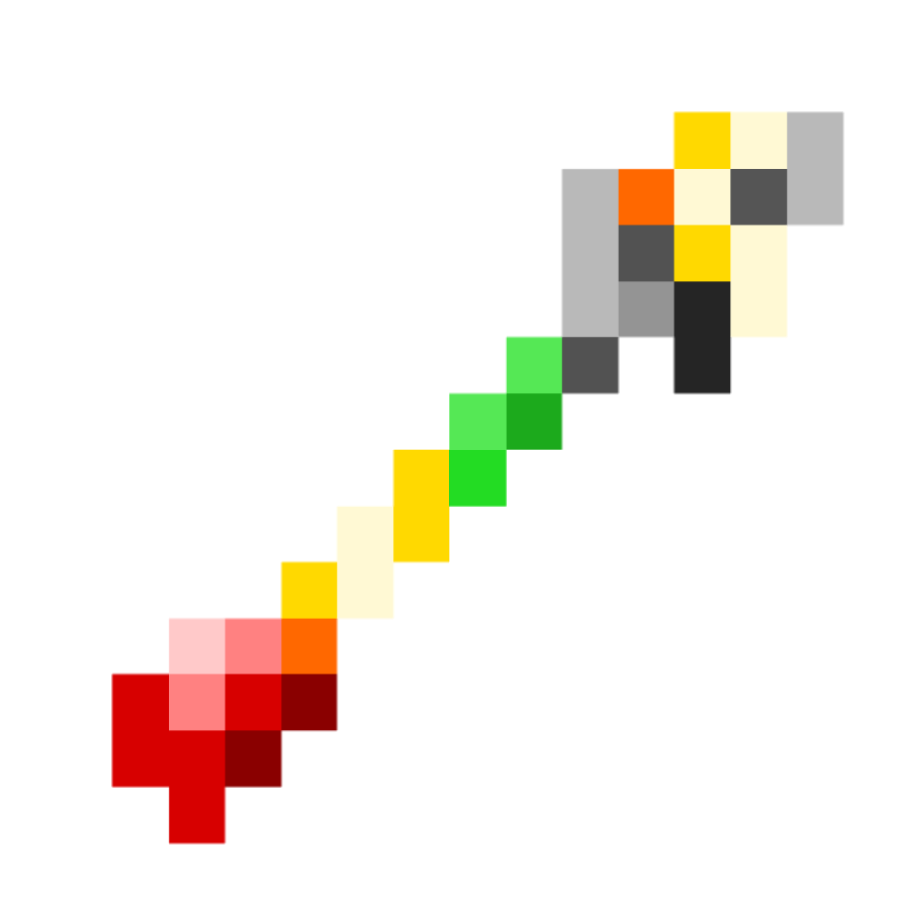

# BowParticle

A plugin for pocketmine 5 that shows particles when shooting arrows!

# Features

These are some of the most important plugin teatures:

- UI menu for easy particle selection
- Customizable ticks between each particle
- Customizable prefix

# Particles

This is a list of plugin particles:

- Flame
- Water
- Heart
- Smoke
- Portal
- LavaDrip
- WaterDrip
- Redstone
- SnowballPoof
- AngryVillager
- HappyVillager
- EnchantmentTable

# Command

This is the plugin command details:

Command | Description | Permission
--- | --- | ---
`/bowparticle` | Select a particle for your bow shots! | bowparticle.command

# ScreenShot

This is a screenshot of plugin:

